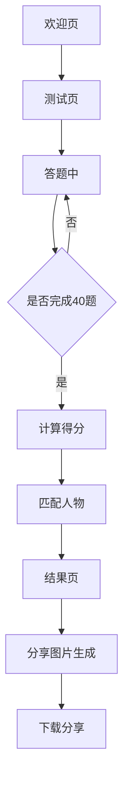

## 1. 产品概述
"你最像历史上的哪个人物？"是一款基于6维人格结构模型的心理测试Web应用。用户通过回答40道精心设计的测试题，系统通过专业算法分析其人格特质，匹配最相似的历史人物，并生成精美的分享图片。

产品旨在为用户提供有趣、有深度的自我认知体验，通过历史人物的人格映射，让用户在娱乐中获得对自我性格的洞察，同时提供社交分享价值。

## 2. 核心功能

### 2.1 用户角色
| 角色 | 注册方式 | 核心权限 |
|------|----------|----------|
| 访客用户 | 无需注册 | 完成测试、查看结果、生成分享图片 |

### 2.2 功能模块
测试网站包含以下核心页面：
1. **欢迎页**：测试介绍、开始测试按钮
2. **测试页**：题目展示、选项选择、进度显示
3. **结果页**：历史人物匹配、人格维度分析、分享图片生成
4. **分享页**：图片预览、下载分享功能

### 2.3 页面详情
| 页面名称 | 模块名称 | 功能描述 |
|----------|----------|----------|
| 欢迎页 | 标题区域 | 显示测试主题"你最像历史上的哪个人物？"，副标题说明测试内容 |
| 欢迎页 | 介绍区域 | 简要介绍测试的科学性和趣味性，包含开始测试按钮 |
| 欢迎页 | 风格展示 | 展示手写童趣风格的设计元素 |
| 测试页 | 题目展示 | 显示当前题号和问题内容，支持40题连续作答 |
| 测试页 | 选项区域 | 提供A/B/C/D四个选项，单选模式，点击后自动进入下一题 |
| 测试页 | 进度指示 | 显示答题进度（如：第12题/共40题），进度条可视化 |
| 测试页 | 导航控制 | 支持上一题/下一题切换，允许修改之前的选择 |
| 结果页 | 人物匹配 | 展示最匹配的历史人物，包含人物头像、姓名、朝代信息 |
| 结果页 | 人格分析 | 显示6维人格雷达图，包含P/S/E/I/R/T六个维度的得分 |
| 结果页 | 人物描述 | 提供匹配人物的性格特点、历史成就、人格特质说明 |
| 结果页 | 分享功能 | 生成包含测试结果的精美图片，支持一键下载 |
| 分享页 | 图片预览 | 展示生成的分享图片，包含用户人格维度图表 |
| 分享页 | 下载分享 | 提供图片下载功能，支持保存到本地 |

## 3. 核心流程
用户操作流程：
1. 用户进入欢迎页，阅读测试介绍
2. 点击开始测试，进入测试页面
3. 依次回答40道测试题，可随时修改答案
4. 完成所有题目后，系统自动计算人格维度得分
5. 根据得分匹配历史人物，展示结果页面
6. 用户可查看详细的人格分析和历史人物介绍
7. 点击分享按钮，生成精美的测试结果图片
8. 下载分享图片，保存到本地或分享到社交平台

## 4. 用户界面设计

### 4.1 设计风格
- **主色调**：温暖浅色系，以米白色(#FEF9E7)、浅粉色(#FFE4E1)、薄荷绿(#E0F2F1)为主
- **辅助色**：淡黄色(#FFF8DC)、天蓝色(#E0F6FF)，营造温馨童趣氛围
- **按钮样式**：圆润边角，手写风格，带有轻微阴影效果
- **字体选择**：手写体风格字体，标题使用较大字号(24-32px)，正文使用中等字号(16-18px)
- **布局风格**：卡片式布局，留白充足，元素间距宽松舒适
- **图标风格**：手绘线条图标，简洁可爱，符合童趣主题

### 4.2 页面设计概述
| 页面名称 | 模块名称 | UI元素 |
|----------|----------|--------|
| 欢迎页 | 标题区域 | 手写风格大标题，粉色渐变文字效果，添加小星星装饰元素 |
| 欢迎页 | 介绍区域 | 米色卡片背景，圆角边框，手写体描述文字，添加历史人物剪影装饰 |
| 欢迎页 | 开始按钮 | 薄荷绿渐变按钮，白色手写字体，悬停时有轻微放大效果 |
| 测试页 | 题目卡片 | 白色圆角卡片，浅粉色边框，题目文字使用深灰色手写体 |
| 测试页 | 选项按钮 | 四个圆形按钮排成2×2网格，薄荷绿/淡粉色/天蓝色/米黄色，选中状态有边框高亮 |
| 测试页 | 进度条 | 薄荷绿渐变进度条，显示百分比，下方显示当前题号 |
| 结果页 | 人物展示 | 大尺寸圆形人物头像，粉色边框装饰，人物姓名使用金色渐变文字 |
| 结果页 | 雷达图 | 六边形雷达图显示人格维度，使用六种不同浅色，网格线使用淡灰色 |
| 结果页 | 分享按钮 | 天蓝色渐变按钮，白色图标，包含相机图标和"生成分享图"文字 |
| 分享页 | 图片预览 | 圆角矩形预览框，添加纸张纹理背景，模拟真实照片效果 |
| 分享页 | 下载按钮 | 绿色渐变按钮，包含下载图标，提供"保存到相册"提示 |

### 4.3 精致移动端设计
- **移动端优先**：采用移动优先设计策略，确保小屏幕上的精致体验
- **精致适配**：专门为移动端优化布局，字体大小、间距、触摸区域都经过精心设计
- **断点设计**：
  - 小屏手机：< 375px (iPhone SE等)
  - 标准手机：375px - 768px
  - 平板/桌面：> 768px
- **触摸优化**：所有交互元素最小48px×48px，符合移动端无障碍标准
- **安全区域处理**：适配iPhone刘海、安卓导航栏等现代手机安全区域
- **手势支持**：支持滑动切换题目、长按保存图片等移动端特有交互
- **字体渲染**：使用系统字体栈，确保在不同移动设备上的最佳显示效果
- **图片生成**：使用@zumer/snapdom库专门为移动端优化分享图片生成，确保高清输出和快速处理

### 4.4 特殊交互效果
- **页面切换**：采用淡入淡出动画，营造流畅体验
- **选项选择**：点击选项时有轻微弹跳动画，提供触觉反馈
- **进度更新**：进度条平滑过渡，数字计数器有滚动效果
- **结果展示**：雷达图采用动画绘制，从中心点向外扩展
- **图片生成**：生成分享图片时有加载动画，完成后有成功提示