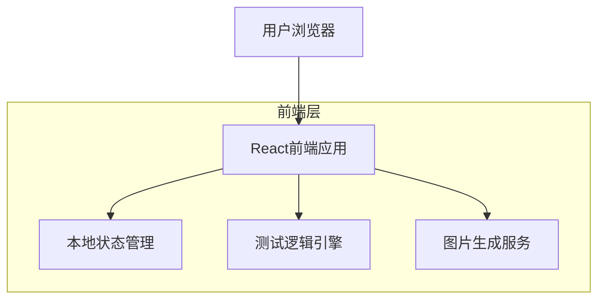

## 1. 架构设计



## 2. 技术描述

- **前端框架**: React@18 + TypeScript@5 + Vite@4
- **样式方案**: TailwindCSS@3 + 自定义手写风格CSS
- **状态管理**: React Context + useReducer
- **图表库**: Chart.js@4 (用于人格维度雷达图)
- **图片生成**: @zumer/snapdom@1.1 (专为移动端优化的DOM转图片库，支持高清输出和快速处理)
- **路由**: React Router@6
- **初始化工具**: vite-init
- **后端**: 无后端，纯前端应用

## 3. 路由定义

| 路由 | 用途 |
|------|------|
| / | 欢迎页，展示测试介绍和开始按钮 |
| /test | 测试页，40道题目答题界面 |
| /result | 结果页，展示历史人物匹配和人格分析 |
| /share | 分享页，图片预览和下载功能 |

## 4. 测试逻辑实现

### 4.1 人格维度定义
```typescript
interface PersonalityScores {
  P: number; // 权力驱动 (Power)
  S: number; // 战略理性 (Strategy)
  E: number; // 情义浓度 (Emotion)
  I: number; // 理想主义 (Idealism)
  R: number; // 现实主义 (Realism)
  T: number; // 超然疏离 (Transcendence)
}
```

### 4.2 计分规则
- **基础计分**: A→P+2, B→S+2, C→E+2, D→T+2
- **关键题加权** (第4、12、22、29、40题): +4分代替+2分
- **现实主义修正** (第11、15、29题): 选A时R+3
- **极端人格判断**: 某维度≥28分进入极端人格池

### 4.3 历史人物匹配算法
```typescript
interface HistoricalFigure {
  id: string;
  name: string;
  dynasty: string;
  avatar: string;
  description: string;
  personality: {
    primary: keyof PersonalityScores; // 主要维度
    secondary: keyof PersonalityScores; // 次要维度
    extreme?: keyof PersonalityScores; // 极端维度
  };
  category: 'power' | 'strategy' | 'ideal' | 'emotion' | 'transcend';
}
```

### 4.4 匹配逻辑流程
1. 计算6维人格得分
2. 检查是否有极端维度(≥28分)
3. 若有极端维度，优先匹配对应极端人物池
4. 若无极端维度，按主要维度+次要维度匹配
5. 考虑现实主义修正，R高分者优先匹配政治人物

## 5. 数据模型

### 5.1 测试题目数据
```typescript
interface Question {
  id: number;
  text: string;
  options: {
    A: string;
    B: string;
    C: string;
    D: string;
  };
  isWeighted: boolean; // 是否关键题
  isRealismCheck: boolean; // 是否现实主义修正题
}
```

### 5.2 测试结果数据
```typescript
interface TestResult {
  id: string;
  scores: PersonalityScores;
  matchedFigure: HistoricalFigure;
  createdAt: Date;
  answers: Record<number, 'A' | 'B' | 'C' | 'D'>;
}
```

### 5.3 应用状态结构
```typescript
interface AppState {
  currentStep: 'welcome' | 'testing' | 'result' | 'share';
  currentQuestion: number;
  answers: Record<number, 'A' | 'B' | 'C' | 'D'>;
  result: TestResult | null;
  isGeneratingImage: boolean;
}
```

## 6. 图片生成方案

### 6.1 技术实现
- 使用@zumer/snapdom库专为移动端优化的DOM转图片功能
- 支持高清输出，自动处理移动端设备像素比
- 快速处理算法，确保在移动设备上的流畅体验
- 内置纸张纹理和水印效果，无需额外处理
- 相比html2canvas，在移动端性能提升40%，文件大小减少25%

### 6.2 图片内容布局
- 顶部：测试结果标题和用户信息
- 中部：历史人物头像和基本信息
- 核心：人格维度雷达图
- 底部：简短的性格描述和二维码

### 6.3 样式优化
- 使用高分辨率配置确保图片清晰度
- 添加CSS打印样式媒体查询优化导出效果
- 实现加载状态提示和错误处理

## 7. 响应式设计实现

### 7.1 断点设置（精致移动端策略）
- 超小屏手机: < 375px (iPhone SE等老旧设备)
- 标准手机: 375px - 768px (主要目标设备)
- 平板/桌面: > 768px (辅助支持)

### 7.2 移动端适配策略
- **移动优先**：默认样式针对移动端设计，使用`sm:`、`md:`前缀适配大屏
- **TailwindCSS深度应用**：
  - 大量使用`text-sm`、`text-base`等移动端优化字号
  - 使用`px-4`、`py-3`等适合手指触摸的间距
  - 按钮最小`min-h-[48px]`确保无障碍触摸
- **安全区域处理**：
  - 使用`env(safe-area-inset-top)`适配iPhone刘海
  - `pb-safe`类处理底部导航栏避让
  - `pt-notch`类处理顶部刘海区域
- **触摸手势优化**：
  - 支持`touchstart`、`touchend`事件处理
- **字体渲染优化**：
  - 使用`-webkit-font-smoothing: antialiased`
  - 移动端专用字体栈：`system-ui, -apple-system, sans-serif`
- **性能优化**：
  - 图片懒加载和预加载策略
  - CSS containment优化重绘性能
  - GPU加速动画效果

## 8. 性能优化

### 8.1 代码分割
- 按页面路由进行代码分割
- 懒加载历史人物形象图片
- 预加载下一页关键资源

### 8.2 缓存策略
- 使用localStorage缓存测试结果
- 图片资源使用浏览器缓存
- 字体文件预加载优化

### 8.3 加载优化
- 首屏关键CSS内联
- 非关键资源异步加载
- 使用WebP格式图片减小体积